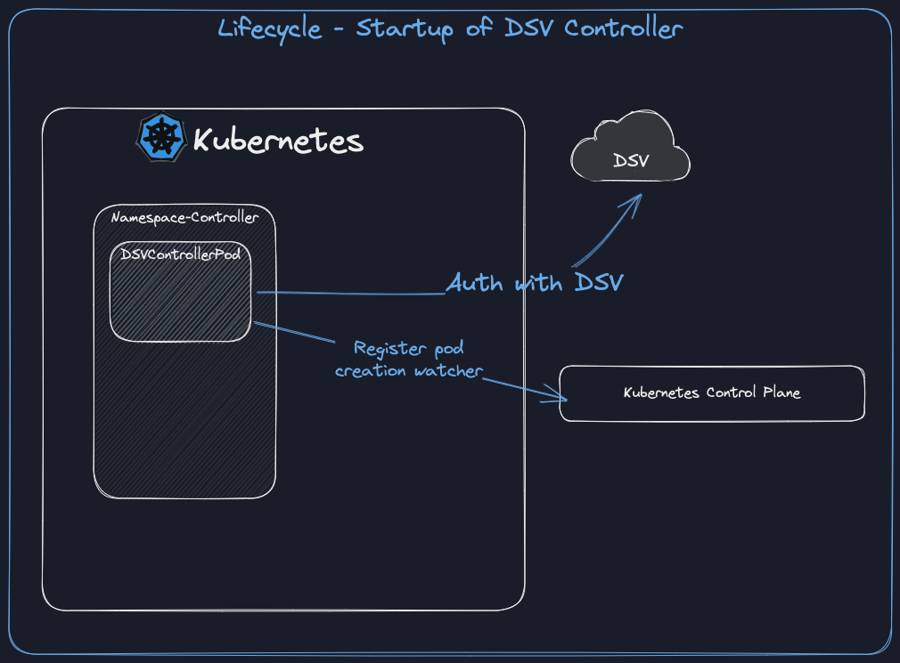
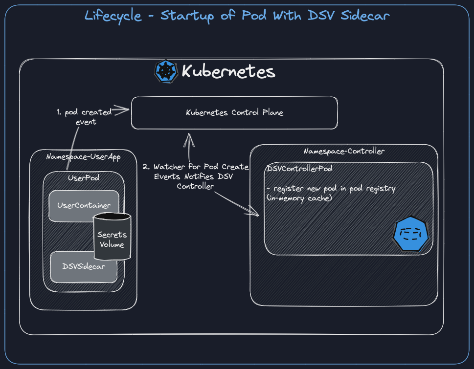
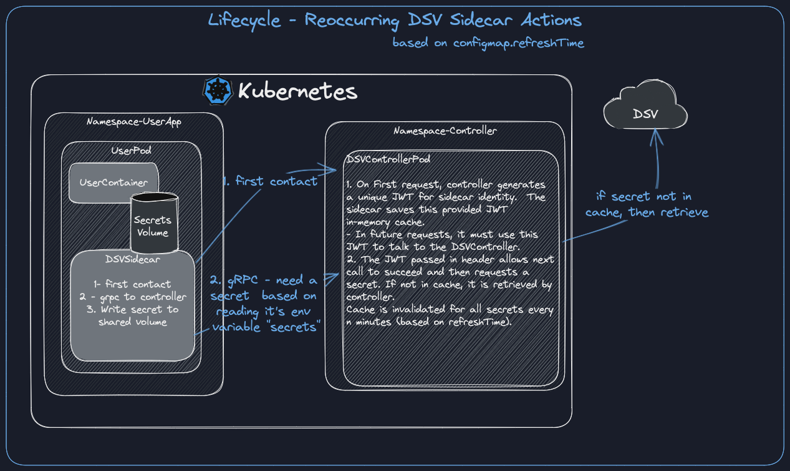

# Architecture

## Startup of DSV Controller

The startup of the DSV Controller is shown:

## Startup of Sidecar

The initial startup of the sidecar results in a pod registration with the DSV Controller as it listens to pod creation events.
Only pods registered with the DSV Controller in this way are authorized to communicate.

## Reoccurring Sidecar Actions

The sidecar is included in a user deployment and has 2 main phases of activity.

1. The initial startup and authorization with the controller, at which point it obtains a unique JWT to authorize the next stage.
1. The secrets retrieval is performed using the JWT obtained in step 1.

